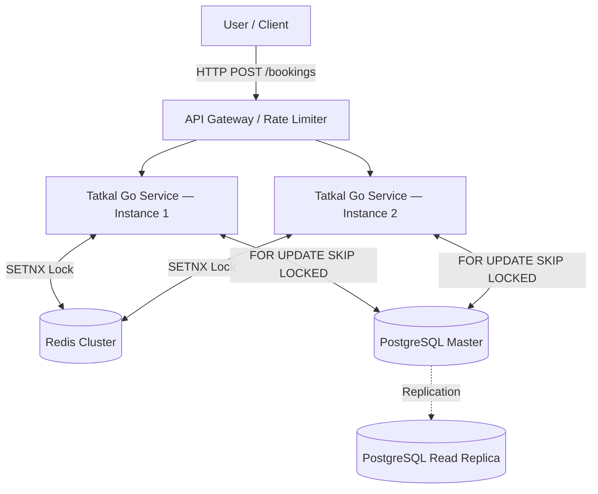

# Tatkal— Distributed High-Concurrency Booking Engine


Tatkal is a high-performance backend engine built to survive the **"Thundering Herd" problem** — the kind of massive concurrent traffic spike that happens during Tatkal train bookings or flash sales.

**Guarantees:**
- Zero double bookings under concurrent load
- High throughput during traffic spikes
- Graceful degradation without data corruption


---

## The Problem This Solves

When thousands of users hit "Book" at the same time, naive systems break in two ways:

1. **Double booking** — two users get the same seat
2. **Deadlocks** — database transactions block each other and throughput collapses

Tatkal solves both using a layered concurrency strategy: Redis distributed locks at the cache layer, and `FOR UPDATE SKIP LOCKED` at the database layer.

---

## Key Engineering Decisions

### Distributed Locking (Redis)

Each seat is locked using `SETNX seat_lock:{seat_id}` with a **3-minute TTL** tied to the payment window.

- Lock acquired → booking proceeds
- Lock already held by another node → API returns **HTTP 409 Conflict** immediately
- Payment timeout → lock expires, seat returns to the pool automatically

This prevents race conditions across horizontally scaled service instances without a central coordinator.

---

### Database Concurrency (PostgreSQL)

Seats are claimed using row-level locking:

```sql
SELECT seat_id
FROM seats
WHERE train_id = $1
FOR UPDATE SKIP LOCKED
LIMIT $2
```

`SKIP LOCKED` means workers don't queue behind each other — they skip contested rows and grab the next available seat. This keeps throughput high under parallel load without deadlocks.

---

### Failure Recovery (Saga-Style Rollback)

If a multi-seat booking fails mid-execution (e.g., seat 3 of 4 is unavailable):

- All previously acquired Redis locks are released immediately
- No orphaned seat inventory
- No manual cleanup required

---

### Clean / Hexagonal Architecture

Core business logic has zero dependency on any framework or infrastructure:

- **Domain layer** defines interfaces (Ports)
- **Adapters** implement those interfaces (Redis, PostgreSQL, HTTP)
- Database or cache can be swapped without touching business logic

---

## System Architecture

### High-Level Design



### Booking Execution Flow

```
1. Fail-fast seat availability check
        ↓
2. Seat discovery via FOR UPDATE SKIP LOCKED
        ↓
3. Redis SETNX lock per seat (3-min TTL)
        ↓
4. Write PENDING booking to PostgreSQL
        ↓
5. Return payment window to user
        ↓
   [Payment success] → mark CONFIRMED
   [Timeout / failure] → lock expires, seat freed
```

---

## Project Structure

```
tatkal-engine/
│
├── cmd/
│   └── api/
│       └── main.go                  # Entry point
│
├── internal/
│   ├── adapters/                    # Infrastructure layer
│   │   ├── cache/redis/             # Redis lock implementation
│   │   ├── db/postgres/             # PostgreSQL repository
│   │   └── handlers/http/           # REST handlers (Chi router)
│   │
│   └── core/
│       ├── domain/                  # Entities: Train, Seat, Booking
│       ├── ports/                   # Interfaces (repository contracts)
│       └── services/                # Business logic
│
├── config/                          # App configuration
└── pkg/                             # Shared utilities
```

---

## Quick Start

**Prerequisites:** Go 1.21+, Docker, Docker Compose

```bash
# Clone the repo
git clone https://github.com/yourusername/tatkal-engine.git
cd tatkal-engine

# Start PostgreSQL + Redis
docker-compose up -d

# Run the server
go run cmd/api/main.go
# → http://localhost:8080
```

---

## What This Demonstrates

| Problem | Solution |
|---|---|
| Double booking under concurrency | Redis SETNX distributed lock |
| Database deadlocks at scale | `FOR UPDATE SKIP LOCKED` |
| Partial booking failures | Saga-style rollback |
| Multi-node coordination | Stateless services + shared Redis |
| Payment window seat hold | Lock TTL = payment timeout |

---

## License

MIT
